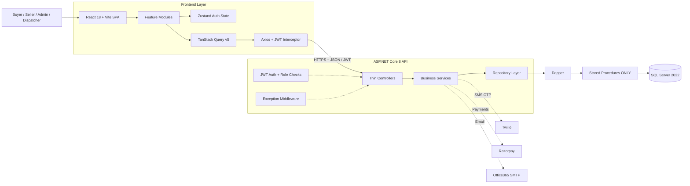

<!-- Hero image — to be added at docs/images/stopnshop-platform-showcase.png -->


# StopNShop

**Shop the look. Own the moment.**

StopNShop — a modern fashion & lifestyle e-commerce platform for India, inspired by Shoppers Stop. Multi-role marketplace with buyer shopping, seller storefronts, admin control, and an OTP-verified dispatcher delivery workstream. Built by Prakash Software Solutions (PSSPL) with React 18, ASP.NET Core 8, Dapper & SQL Server 2022.

**Website:** [https://www.prakashinfotech.com](https://www.prakashinfotech.com)

[](https://react.dev/)
[](https://dotnet.microsoft.com/)
[](https://www.microsoft.com/sql-server)
[](LICENSE.txt)

---

## The Problem

Running a fashion marketplace means serving four very different users at once — shoppers who want a fast, trustworthy buying journey; sellers who need to list products, manage stock, and fulfil orders; admins who must approve sellers and moderate the catalogue; and delivery staff who need a reliable last-mile handover. Most projects bolt these on inconsistently, with ad-hoc data access and no clean separation between them.

## The Solution

StopNShop delivers all four roles on one platform with a strict layered architecture. Buyers get catalogue search, wishlists, cart, coupons, and live order tracking. Sellers get a full storefront and fulfilment portal with inventory, settlements, and printable labels. Admins get approvals and CMS control. Dispatchers get a pickup-to-delivery flow secured with SMS OTP handover. Every request flows through **Controller → Service → Repository** with **stored-procedure-only** data access — no inline SQL, no ORM.

## Features

| Category | Details |
|---|---|
| **Catalogue & Search** | Product search, mega-menu, size/colour filters, PDP with image gallery & size charts |
| **Buyer Journey** | Wishlist, cart, 3-step checkout, coupons, order history + live tracking timeline |
| **Seller Portal** | Onboarding, product & variant management, inventory with movement history, order-queue fulfilment, settlements, KPI dashboard with 14-day chart |
| **Dispatcher Workstream** | Pickup queue, out-for-delivery, and **OTP-verified delivery** handover (status 4 → 9 → 5) |
| **Admin Panel** | Seller/product approvals, category & variant library, CMS banners, users, orders, dashboard stats |
| **Authentication** | Mobile OTP + email/password login, PBKDF2 hashing, role-based JWT (Admin/Buyer/Seller/Dispatcher) |
| **Payments & Wallet** | Razorpay payment integration, buyer wallet |
| **Notifications** | In-app notifications + email confirmations (SMTP) |
| **Responsive UI** | Mobile-first design, warm-cream + brand-red design system, light/dark tokens |

---

## Project Preview

<!-- Preview images — to be added later -->


_Buyer storefront with catalogue filters, product cards, and mega-menu navigation._


_Seller workspace for monitoring orders, inventory, settlements, and 14-day sales trend._

---

## Architecture & Application Flow

StopNShop follows a strict layered full-stack architecture. The React SPA owns the user experience, the ASP.NET Core API owns authentication and business rules, and Dapper repositories call **stored procedures only** against SQL Server.



### Typical User Journey

1. A shopper searches by category, brand, price, size, or colour and browses results with mega-menu context.
2. The frontend requests matching products from the API and renders listings and product detail.
3. After authentication, buyers save to wishlist, add to cart, apply coupons, and check out in three steps.
4. Sellers publish products, manage inventory, and fulfil orders from an order-queue dashboard.
5. Dispatchers claim pickups, mark out-for-delivery, and complete delivery with an SMS OTP handover.
6. Admins approve sellers/products and manage the catalogue and CMS through role-protected endpoints.

---

## Tech Stack

| Layer | Technology |
|---|---|
| **Frontend** | React 18, TypeScript, Vite, Tailwind CSS |
| **UI / UX** | Lucide Icons, Framer Motion, Recharts, design-token system (light/dark) |
| **State Management** | Zustand + TanStack Query v5 |
| **Forms** | React Hook Form + Zod |
| **Backend** | .NET 8, ASP.NET Core Web API, Serilog, FluentValidation |
| **Data Access** | Dapper (micro-ORM), **stored procedures only** |
| **Database** | SQL Server 2022 (SSDT project — 65 tables, 198 stored procedures) |
| **Auth** | JWT Bearer (HS256), PBKDF2 hashing, roles: Admin / Buyer / Seller / Dispatcher |
| **Integrations** | Twilio (SMS OTP), Razorpay (payments), Office365 SMTP (email) |
| **API Docs** | Swagger / OpenAPI |
| **Runtime** | Docker Compose (db + api + ui) |
| **Testing** | xUnit (API unit + integration), Vitest + Testing Library (UI) |

---

## Prerequisites

The recommended path is Docker — it runs the whole stack (db + api + ui) with one command.

| Tool | Version | Download |
|---|---|---|
| **Docker** | Latest | [docker.com](https://www.docker.com/) |

For a manual, non-Docker run you instead need:

| Tool | Version | Download |
|---|---|---|
| **.NET SDK** | 8.0+ | [dotnet.microsoft.com](https://dotnet.microsoft.com/download/dotnet/8.0) |
| **Node.js** | v20+ | [nodejs.org](https://nodejs.org/) |
| **SQL Server** | 2022 | [microsoft.com/sql-server](https://www.microsoft.com/sql-server) |

### Optional Service Accounts

| Service | When It Is Needed |
|---|---|
| **Twilio** | Only for live SMS OTP delivery (leave blank to disable) |
| **Razorpay** | Only for live payment processing (test keys work locally) |
| **SMTP mailbox** | Only for outbound email notifications (leave blank to disable) |

> Source-code review and local development do not require any of the optional accounts — the app runs and seeds a full catalogue without them.

---

## Getting Started

### 1. Clone the Repository

```bash
git clone https://github.com/prakashinfotech/stop-n-shop.git
cd stop-n-shop
```

### Option A — Docker (whole stack, one command) ✅ recommended

```bash
cp .env.example .env      # then fill in SA_PASSWORD, JWT_SECRET_KEY, (optional) Twilio/SMTP
docker compose up -d --build
```

| Service | URL |
|---|---|
| 🛍️ UI | http://localhost:3000 |
| 🔌 API | http://localhost:5000/api/products |
| 🗄️ SQL Server | localhost:1433 |

The `db` container auto-creates the database, applies the schema, and loads seed data on first boot. See [`db/MIGRATIONS.md`](db/MIGRATIONS.md) for details.

### Option B — Manual (run each tier locally)

**Database** — follow [`db/MIGRATIONS.md`](db/MIGRATIONS.md) (Docker, `sqlcmd`, or SSDT publish).

**Backend (.NET):**

```bash
cd api
cp appsettings.Development.json.example appsettings.Development.json   # fill in values — never commit
dotnet restore
dotnet run                 # → http://localhost:5000  (Swagger at /swagger in Development)
```

> **Tip:** For local dev you can also use [.NET User Secrets](https://learn.microsoft.com/en-us/aspnet/core/security/app-secrets) or environment variables (`ConnectionStrings__ShopNShop`, `Jwt__SecretKey`, `Twilio__*`, `Smtp__*`) instead of editing `appsettings.Development.json`.

**Frontend (React + Vite):**

```bash
cd stopnshop-ui
npm install
npm run dev                # → http://localhost:3000  (proxies /api → :5000)
```

### Environment Variables

Every secret is supplied via environment variables — **only `.env.example` is committed**; the real `.env` is git-ignored and must never be pushed.

| Variable | Required | Description |
|---|---|---|
| `SA_PASSWORD` | ✅ | SQL Server `sa` password (Docker DB) |
| `JWT_SECRET_KEY` | ✅ | JWT HS256 signing secret (≥ 32 chars) |
| `TWILIO_ACCOUNT_SID` / `TWILIO_AUTH_TOKEN` / `TWILIO_FROM_NUMBER` | optional | SMS OTP |
| `SMTP_USER` / `SMTP_PASSWORD` / `SMTP_FROM_EMAIL` / `SMTP_TO_EMAIL` | optional | Outbound email |

---

## Project Structure

```text
stop-n-shop/
├── api/                    # ASP.NET Core 8 Web API
│   ├── Controllers/        # Thin controllers (auth, catalog, cart, orders, seller, admin, dispatcher…)
│   ├── Services/           # Business logic layer
│   ├── Repositories/       # Dapper repositories (stored-procedure calls)
│   ├── DTOs/               # Request/response models
│   ├── Middleware/         # Exception + request-logging middleware
│   └── Program.cs          # DI, JWT, Swagger, Serilog, pipeline
│
├── stopnshop-ui/           # React 18 + TypeScript + Vite SPA
│   └── src/
│       ├── features/       # Feature modules (products, cart, seller, dispatch, admin…)
│       ├── components/     # Shared UI primitives + layout
│       ├── api/            # Typed API client modules (axios)
│       ├── store/          # Zustand stores
│       └── router/         # AppRouter with lazy routes + role guards
│
├── ShopNStopDB/            # SQL Server SSDT project — source of truth
│   └── dbo/                # Tables (65), StoredProcedures (198), Data (seeds)
│
├── db/                     # Docker DB bootstrap: schema.sql + seed.sql + patches/
│   └── MIGRATIONS.md       # DB setup, seed data, and incremental patches
│
├── tests/                  # xUnit — UnitTests + IntegrationTests
├── docs/                   # Architecture, API reference, CI/CD, AI-prompt logs
├── .github/workflows/      # CI/CD pipelines
├── docker-compose.yml      # Local full stack (db + api + ui)
├── docker-compose.prod.yml # Production compose
└── .env.example            # Secret template
```

---

## API Endpoints

The backend exposes these representative groups (full interactive docs at `/swagger` in Development). Every response uses the `ApiResponse<T> { success, message, data, errors }` envelope.

| Method | Endpoint | Description |
|---|---|---|
| `POST` | `/api/auth/buyer/register` | Register a new buyer |
| `POST` | `/api/auth/buyer/login` | Buyer login (email + password) |
| `POST` | `/api/auth/seller/login` | Seller login |
| `POST` | `/api/auth/dispatcher/login` | Dispatcher login |
| `POST` | `/api/auth/admin/login` | Admin login |
| `POST` | `/api/auth/otp/send` · `/api/auth/otp/verify` | Mobile OTP send / verify |
| `GET` | `/api/products` | List / search products (paginated) |
| `GET` | `/api/products/{id}` | Product details |
| `GET` | `/api/products/trending` | Trending products |
| `GET` | `/api/brands` | List brands |
| `GET` `POST` | `/api/cart` | Get cart / add item (Buyer) |
| `PUT` `DELETE` | `/api/cart/{cartId}` | Update qty / remove item (Buyer) |
| `GET` `POST` | `/api/wishlist` · `/api/wishlist/{productId}` | Wishlist (Buyer) |
| `POST` `GET` | `/api/orders` | Place order / list my orders (Buyer) |
| `GET` | `/api/seller/products` | Seller's product catalogue (Seller) |
| `GET` | `/api/admin/products/pending` | Products awaiting approval (Admin) |
| `GET` | `/api/dispatcher/pickups` | Dispatcher pickup queue (Dispatcher) |
| `POST` | `/api/dispatcher/deliveries/{id}/send-otp` · `/complete` | OTP-verified delivery (Dispatcher) |

---

## Development

### Frontend Commands

```bash
npm run dev          # Start dev server (port 3000)
npm run build        # Production build
npm run lint         # ESLint
npm run test         # Vitest
```

### Backend Commands

```bash
dotnet run           # Start API server (port 5000)
dotnet build         # Build project
dotnet test tests/StopNShop.Api.UnitTests
dotnet test tests/StopNShop.Api.IntegrationTests
```

---

## Security

- **Authentication:** JWT bearer tokens, PBKDF2 password hashing, and role-based access (Admin / Buyer / Seller / Dispatcher), with a separate login endpoint per role over shared JWT infrastructure.
- **Data access:** All database access uses parameterized Dapper calls to **stored procedures only** — no inline SQL — guarding against SQL injection.
- **Secrets:** No secrets are committed. `appsettings.json` ships with placeholders; secrets are injected at runtime via environment variables (`SA_PASSWORD`, `JWT_SECRET_KEY`, `Twilio__*`, `Smtp__*`). `.env` and `appsettings.Development.json` are git-ignored, and credential-file patterns (`*CREDENTIALS*`, `*.pem`, `*.pfx`, `*.key`) are blocked so secret handoffs can never be committed.
- **Reporting:** To report a vulnerability, please follow [SECURITY.md](SECURITY.md) rather than opening a public issue.

---

## Deployment

Local and production runs both use Docker Compose:

```bash
docker compose up -d --build                       # local (db + api + ui)
docker compose -f docker-compose.prod.yml up -d    # production compose
```

CI/CD pipelines live in [`.github/workflows/`](.github/workflows/) (API, UI, and database deploys, plus test and regression workflows). Configure the production database connection, JWT secret, and any integration credentials as environment variables / repository secrets in your hosting platform — **never commit them**.

---

## Contributing

Contributions are welcome. Please read [CONTRIBUTING.md](CONTRIBUTING.md) for setup, quality checks, and the pull-request process.

1. Create a feature branch (`git checkout -b feat/<scope>`)
2. Follow the project conventions — **Controller → Service → Repository**, stored-procedure-only data access, `ApiResponse<T>` on every endpoint, design tokens in the UI.
3. Commit using [Conventional Commits](https://www.conventionalcommits.org/) (`feat:`, `fix:`, `chore:`…).
4. Ensure `dotnet build`, `npm run build`, and the test suites pass.
5. Open a Pull Request into `master`.

---

## License

Licensed under the [MIT License](LICENSE.txt). © 2026 Prakash Software Solutions Pvt. Ltd.

---

## About PSSPL

**Prakash Software Solutions Pvt. Ltd. (PSSPL)** is an enterprise AI and software engineering company with 26+ years of experience, delivering solutions across Artificial Intelligence, Generative AI, Microsoft Azure, Data & AI, and enterprise application development (.NET, React, SQL, Cloud). StopNShop is one of our engineering showcases, demonstrating end-to-end full-stack product delivery.

## 📬 Contact

- 🌐 Website: [www.prakashinfotech.com](https://www.prakashinfotech.com)
- 💼 LinkedIn: [Prakash Software Solutions](https://www.linkedin.com/company/prakash-software-solutions-pvt-ltd)
- ✉️ Email: info@prakashinfotech.com

---

**Built with ❤️ for the Indian fashion retail market by [Prakash Software Solutions (PSSPL)](https://www.prakashinfotech.com)**
